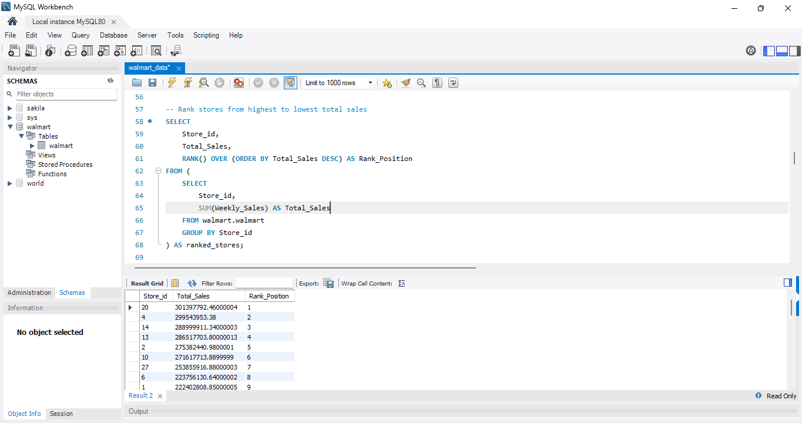

─────────────────────────────────────────────
🛒 WALMART SALES ANALYSIS USING SQL
─────────────────────────────────────────────

📖 **Project Summary**
A data-driven analysis of Walmart’s retail sales using MySQL. 
The goal is to uncover insights on store performance, seasonality, and 
how external factors like fuel price, temperature, and CPI impact sales.

─────────────────────────────────────────────
🎯 OBJECTIVES
─────────────────────────────────────────────
- Clean and standardize inconsistent date formats
- Rank stores by total sales using SQL window functions
- Compare holiday vs non-holiday week sales
- Identify monthly and yearly sales trends
- Analyze economic factors affecting performance

─────────────────────────────────────────────
🧠 TECH STACK
─────────────────────────────────────────────
- MySQL
- Data Cleaning, Aggregation, and Transformation
- Window Functions (`RANK() OVER`)
- Grouping and Conditional Logic (`CASE WHEN`)
- Business Insight Generation

─────────────────────────────────────────────
📊 DATASET DETAILS
─────────────────────────────────────────────
- **Store:** Unique ID for each Walmart store  
- **Date:** Weekly sales date  
- **Weekly_Sales:** Total sales per store per week  
- **Holiday_Flag:** 1 = Holiday week, 0 = Regular week  
- **Temperature, Fuel_Price, CPI, Unemployment:** External variables  

─────────────────────────────────────────────
🔍 ANALYSIS HIGHLIGHTS
─────────────────────────────────────────────
💡 **1. Store Performance Ranking**
```sql
SELECT Store_id, 
       SUM(Weekly_Sales) AS Total_Sales,
       RANK() OVER (ORDER BY SUM(Weekly_Sales) DESC) AS Rank_Position
FROM walmart.walmart
GROUP BY Store_id;
```
🏆 Store 20 achieved the highest overall sales performance.

💡 **2. Holiday Impact**
Holiday weeks showed an average sales boost of 15–25% across most stores.

💡 **3. Monthly Trends**
Peak sales observed during holiday months (Nov–Dec), 
while lowest sales occurred mid-year (June–July).

💡 **4. External Factors**
Temperature and fuel price fluctuations had a measurable effect 
on weekly sales performance.

─────────────────────────────────────────────
📈 INSIGHTS & LEARNINGS
─────────────────────────────────────────────
- Translating raw data into actionable business insights
- Applying analytical SQL concepts to real-world retail data
- Strengthened storytelling and data presentation skills

─────────────────────────────────────────────
🖼️ SAMPLE OUTPUT
─────────────────────────────────────────────

*Figure: Ranking Walmart stores by total sales using SQL window functions.*

─────────────────────────────────────────────
👩‍💻 AUTHOR
─────────────────────────────────────────────
**Nikitha Katta**  
🎓 Graduate Student, University of Delaware  
🔗 [LinkedIn Profile](https://linkedin.com/in/nikitha-k-01564722a)  
📧 nikitha@udel.edu  

─────────────────────────────────────────────
🌟 FUTURE IMPROVEMENTS
─────────────────────────────────────────────
- Create Tableau/Power BI dashboards for visualization
- Automate SQL analysis pipeline using Python
- Add predictive analytics (forecasting sales trends)

─────────────────────────────────────────────
💬 QUOTE
> *“Data isn’t just numbers — it’s the story of business decisions waiting to be discovered.”*
─────────────────────────────────────────────
> *“Data isn’t just numbers — it’s the story of business decisions waiting to be discovered.”*
